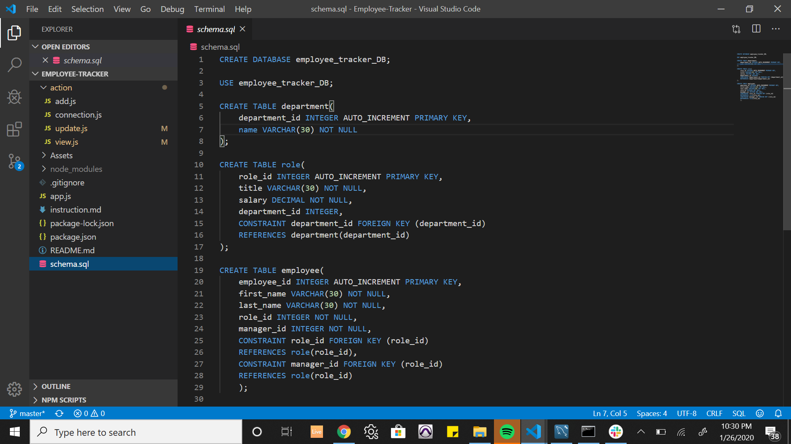
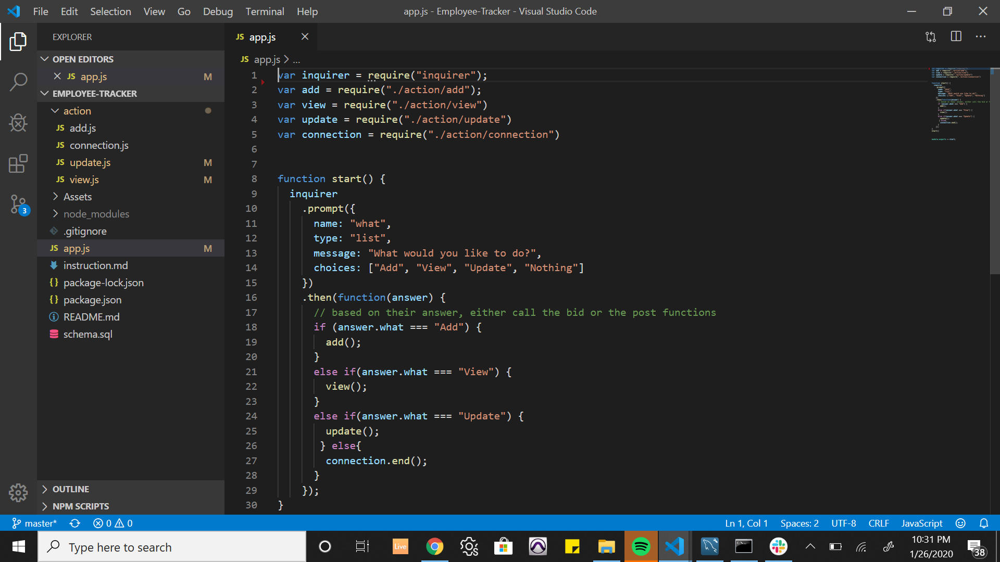
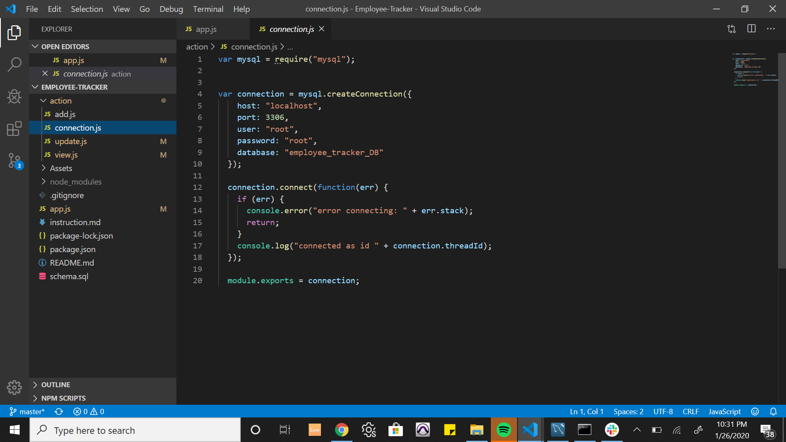
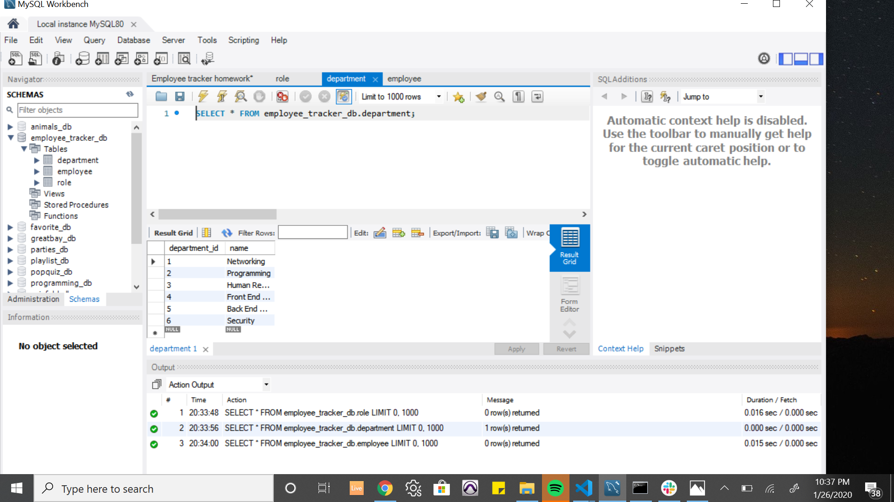
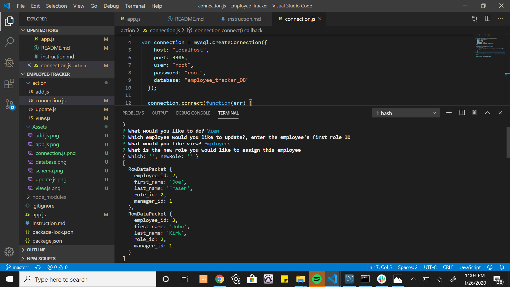
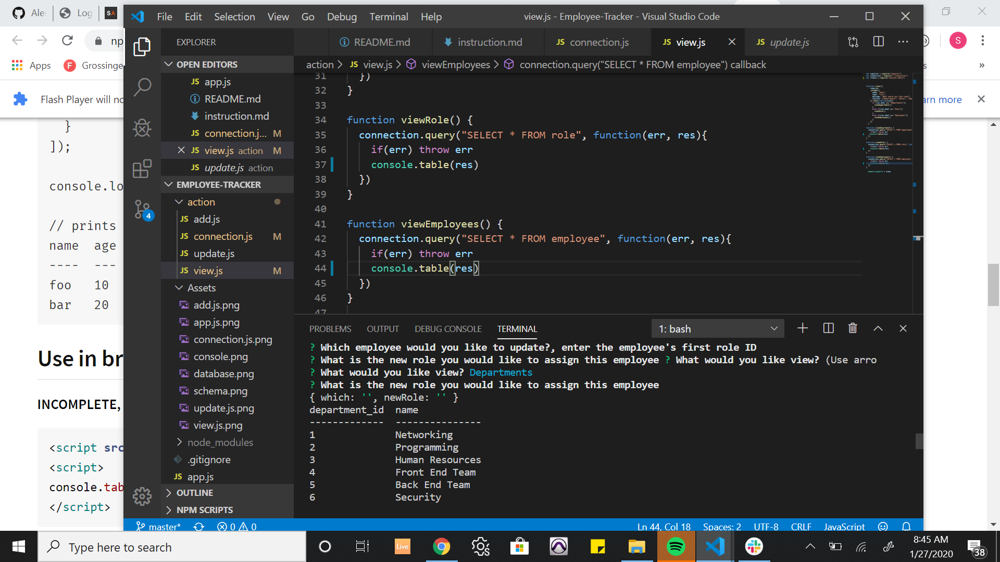

# Employee-Tracker
As the business owner, it is of utmost importance to be able track the enumber of employees, departments, amount spent on salaries and various other things.

I wrote this program in order to be able to easily monitor the important details in order to make the business run smoothly.

I used "inquirer" npm package, console.table npm package and "mysql" npm package for this program.

I used inquirer to propmt some questions and the program will perform some functions depending on the user's input. The mysql helps connect to the MySql database and the console.table package to neatly print details on the console when user chooses view.

## Below are some snapshots of the codes:

## Using console.table to view the departments

## Built with
* VScode

## Usage
* To keep up with the important details in my business.

## Contact
* Segun Alesinloye 
* segunalesh@gmail.com 
* Github repo link: https://github.com/Aleshsparrow/Employee-Tracker

## Acknowledgement
* Inquirer npm package
* Mysql npm package
* console.table npm package